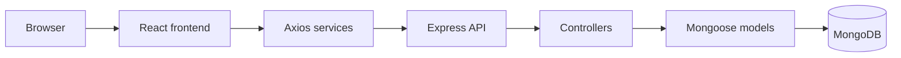

# FreelanceHub-PK - Case Study

## 1. Project Overview

FreelanceHub-PK is a full-stack freelance work-management application for organizing client records, projects, deadlines, budgets, and role-based account access. The implemented product combines a React/Vite frontend with an Express/Mongoose API.

## 2. The Problem

Freelancers need a reliable workspace for keeping client information and project delivery details together. Without a focused workflow, client contacts, project status, deadlines, and financial context can become fragmented.

## 3. The Target Users

The application supports two account roles:

- **Freelancers**, who manage clients and projects and view dashboard metrics.
- **Clients**, who can authenticate and access the current client portal view.

The current client portal is an authenticated workspace state; the repository does not implement a client-scoped project API.

## 4. The Solution

FreelanceHub-PK provides protected role-based navigation and a freelancer workflow for client and project CRUD. The backend validates requests, signs JWTs, enforces role and ownership rules, and exposes dashboard metrics backed by MongoDB.

## 5. Core Features

- Registration and login for freelancer and client roles.
- JWT-backed authentication with protected frontend and backend routes.
- Freelancer dashboard with client, project, budget, status, and deadline metrics.
- Client create, list, view, update, and delete operations.
- Project create, list, view, update, and delete operations.
- Project search, status filtering, and budget/deadline sorting.
- Responsive layouts, mobile navigation, loading skeletons, empty states, API errors, and retry actions.

## 6. Technology Choices

- **React 18 and Vite** provide a component-based frontend with a fast development/build toolchain.
- **React Router** handles public, protected, and role-specific views.
- **Express and Node.js ES modules** provide a small route/controller API architecture.
- **MongoDB and Mongoose** model users, clients, and projects with schema validation and references.
- **JWT and bcryptjs** implement stateless authentication and password hashing.
- **Tailwind CSS** supports responsive utility-based styling and dark-mode variants.
- **Vitest, React Testing Library, and Supertest** provide focused frontend and HTTP behavior tests.

## 7. Architecture

## 8. Authentication and Authorization

Registration and login return JWTs. The frontend stores the token locally and sends it as a Bearer token through an Axios interceptor. Backend middleware verifies the token, loads the user without the password, and enforces role checks.

Freelancer-only client and project routes also check ownership. Frontend role routes send unauthorized users to `/403`, while unauthenticated protected-route access redirects to `/login`.

## 9. Testing and Quality

The repository contains exactly **12 named tests**:

- **5 frontend tests** covering login rendering, login validation, registration validation, protected-route redirect, and the Clients empty state.
- **7 backend tests** covering registration/JWT response, login, invalid credentials, missing-token rejection, client create/list behavior, project create/list behavior, and client-role RBAC.

Frontend tests use Vitest with React Testing Library, jest-dom, user-event, and jsdom. Backend tests use Vitest and Supertest. Backend model persistence is intentionally test-doubled; the suite does not connect to a real MongoDB instance or an in-memory database. This limits the persistence claim while still exercising the HTTP routes, middleware, controller paths, JWT behavior, and response contracts.

## 10. Biggest Challenge

The repository does not record a historical project challenge in Git history. One implementation challenge visible in the current code is enforcing ownership across the related Client and Project resources.

A project cannot be created for an unowned client, and individual client/project operations compare the record owner with the authenticated user. The frontend complements this with role-specific navigation and route guards. This approach keeps multi-user data boundaries at the backend API rather than relying only on frontend visibility.

## 11. UI/UX and Accessibility

The interface uses responsive Tailwind breakpoints, a desktop sidebar, mobile navigation components, responsive forms, and horizontally scrollable wide tables. Core pages expose loading skeletons, empty states, API error messages, and retry actions.

Inputs use labels and form associations, action buttons use descriptive text or accessible labels, and the application uses semantic headings and navigation elements. Dark-mode utility classes exist throughout the interface, but no in-app theme toggle or persisted theme setting is implemented.

## 12. Deployment

No deployment provider configuration or live URL is verifiable in the repository.

**TODO:** Verify the production hosting provider, environment variables, and live URLs before presenting the project publicly.

## 13. Outcome

The completed repository demonstrates a working full-stack foundation for freelance operations: React views communicate with an Express API, MongoDB models define the data relationships, JWT middleware protects requests, role and ownership checks constrain access, and the test suite documents 12 core behaviors.

## 14. Future Enhancements

- Expand the client portal with server-backed project visibility.
- Add messaging, notifications, file management, and payment workflows.
- Add browser-level end-to-end coverage and real MongoDB persistence tests.
- Add CI/CD and documented production deployment.
- Add portfolio screenshots for dashboard, CRUD views, authentication, mobile, and dark-mode states.

## 15. Conclusion

FreelanceHub-PK presents a focused full-stack solution for managing the operational details of freelance work. Its current implementation demonstrates practical React, Express, MongoDB, authentication, authorization, CRUD, validation, responsive UI, and automated testing skills while leaving clear, honest boundaries for the next product iteration.
