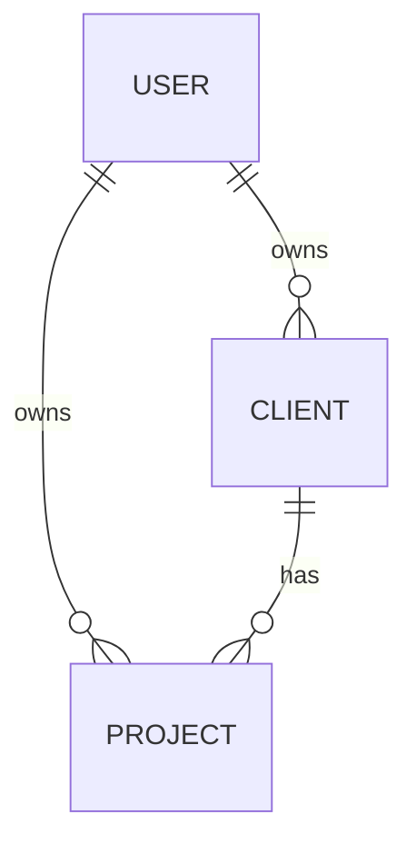

# FreelanceHub-PK Case Study

## 1. Project Overview

FreelanceHub-PK is a full-stack freelance work-management platform for organizing clients, projects, project status, budgets, deadlines, and role-based account access. It supports freelancer and client accounts through a React/Vite frontend and an Express API backed by MongoDB and Mongoose.

## 2. The Problem

Freelancers can struggle to keep client information, projects, deadlines, budgets, and delivery status organized in one place. FreelanceHub-PK addresses this need with a focused workspace for client and project administration.

## 3. Target Users

- **Freelancers** can register, sign in, manage their clients and projects, search and filter records, and review dashboard metrics.
- **Clients** can register, sign in, and access a protected client portal foundation. The current portal displays authenticated client identity and workspace state; expanded server-backed client project visibility is planned.

## 4. The Solution

FreelanceHub-PK combines authentication, protected navigation, role-based authorization, ownership checks, and CRUD workflows in one application. Authenticated freelancers can manage Client and Project records, associate projects with their owned clients, review budget/status/deadline metrics, and use search, filtering, and sorting controls. The frontend and backend both validate input and expose loading, error, retry, and empty states.

## 5. Core Features

- Freelancer and client registration and login.
- JWT authentication with browser token persistence and Axios Bearer-token requests.
- Protected frontend routes and backend JWT middleware.
- Freelancer/client role-based access control and `/403` handling.
- Client create, list, view, update, and delete operations.
- Project create, list, view, update, and delete operations.
- User ownership checks for clients and projects, including client ownership checks when creating or reassigning projects.
- Project search, status filtering, and sorting by recent order, deadline, or budget.
- Freelancer dashboard metrics for clients, projects, budgets, project status, deadlines, monthly project counts, and financial summaries.
- Responsive layouts, desktop/mobile navigation, loading skeletons, empty states, API errors, and retry actions.

File uploads, payments, real-time features, and a user-facing dark-mode toggle are not implemented.

## 6. Technology Choices

- **React 18 and Vite:** component-based UI development with a fast local and production build toolchain.
- **React Router:** public, protected, and role-specific frontend navigation.
- **Axios:** centralized API requests with a configurable base URL and JWT interceptor.
- **Tailwind CSS:** responsive utility-based styling and consistent interface states.
- **Lucide React:** reusable interface icons for navigation, actions, status, and feedback states.
- **Node.js, Express, and ES modules:** a lightweight HTTP API organized into routes, middleware, controllers, and models.
- **MongoDB and Mongoose:** persistent document storage with schemas, references, indexes, timestamps, and validation.
- **jsonwebtoken and bcryptjs:** signed JWT authentication and password hashing.
- **Helmet, CORS, and Morgan:** HTTP security headers, cross-origin policy, and development request logging.
- **Vitest, React Testing Library, jest-dom, user-event, and Supertest:** focused frontend behavior and backend HTTP tests.

## 7. Architecture

```mermaid
flowchart LR
    Browser --> Frontend[React + Vite frontend]
    Frontend --> Router[React Router and AuthContext]
    Router --> Axios[Axios API services]
    Axios --> API[Express API]
    API --> Middleware[Helmet, CORS, auth, and error middleware]
    Middleware --> Routes[Route modules]
    Routes --> Controllers[Controllers]
    Controllers --> Mongoose[Mongoose models]
    Mongoose --> Mongo[(MongoDB Atlas)]
```



The backend uses route and controller modules without a separate service layer. The frontend and backend are deployed separately on Vercel. The frontend Vercel rewrite supports React SPA routes, while the backend Vercel rewrite and serverless entry point route requests to the Express application.

## 8. Authentication and Authorization

Registration accepts a name, email, password, and optional `freelancer` or `client` role. The backend validates required fields and email format, checks whether the email is already registered, hashes the password with the User model's `bcryptjs` pre-save hook, and returns a signed JWT. Login validates credentials and returns a JWT with safe user fields.

The frontend stores the token in local storage under `freelancehub_token`. Axios reads that token and adds an `Authorization: Bearer <token>` header to requests. On initialization, the AuthContext validates a stored token through `/api/auth/me`; logout and unauthorized responses clear the stored token and user state.

Frontend `ProtectedRoute` redirects unauthenticated users to `/login`, and `RoleRoute` redirects users with an invalid role to `/403`. Backend `protect` middleware verifies JWTs and loads the authenticated user without the password. `authorizeRoles('freelancer')` protects freelancer resources, while client and project controllers compare record ownership with the authenticated user before individual reads and mutations.

## 9. CRUD and Data Model

The data relationships are:



- **User:** name, email, hashed password, role, and timestamps.
- **Client:** name, email, company, phone, country, notes, owner reference, and timestamps.
- **Project:** title, description, client reference, budget, deadline, status, owner reference, and timestamps.

Authenticated freelancers can manage their clients. Projects are associated with clients and owned by the authenticated freelancer. The API validates that a selected or reassigned client belongs to that freelancer and checks ownership for client/project reads, updates, and deletes. No cascade delete from clients to projects is implemented.

## 10. Validation and Error Handling

- Frontend forms validate required authentication, client, and project fields before submission.
- Backend controllers validate names, email formats, passwords, roles, ObjectId values, budgets, deadlines, and allowed project statuses.
- Mongoose schemas enforce required fields, email formats, role/status enums, non-negative budgets, references, and timestamps.
- Registration returns a validation error when an email is already registered.
- Invalid credentials and missing or invalid JWTs return authentication errors; role and ownership failures return authorization errors.
- Controllers return structured `success` and `message` response fields for common validation and authorization failures.
- Express provides not-found and centralized error handlers.
- Dashboard, Clients, and Projects render loading skeletons, empty states, visible API errors, and retry actions.

## 11. Testing and Quality

The repository currently contains **12 tests**:

- **5 frontend tests:** login rendering, login validation, registration validation, protected-route redirection, and the Clients empty state.
- **7 backend tests:** registration and JWT response, login, invalid credentials, missing-token rejection, authenticated client create/list behavior, authenticated project create/list behavior, and client-role RBAC.

Frontend tests use Vitest, React Testing Library, jest-dom, user-event, and jsdom. Backend tests use Vitest and Supertest. Backend model methods are test-doubled, so the suite does not connect to a real MongoDB instance or an in-memory database. It verifies HTTP routing, middleware, controller behavior, validation, JWT handling, authorization, and response contracts without claiming persistence integration coverage.

Run the suites with:

```powershell
cd frontend
npm test

cd ..\backend
npm test
```

## 12. UI/UX and Accessibility

The interface uses responsive Tailwind breakpoints, a desktop sidebar, mobile navigation, responsive forms, and horizontally scrollable tables. Core views expose loading skeletons, empty states, API error messages, and retry actions. Form controls use labels and associations, while the application uses semantic headings and navigation elements.

Dark-mode utility classes are present, but an in-app theme toggle or persisted theme preference is not currently implemented.

## 13. Deployment

- **Frontend:** [Vercel deployment](https://capstone-project-freelance-hub-sk8u.vercel.app/) serving the React/Vite application.
- **Backend:** [Vercel deployment](https://capstone-project-freelance-hub.vercel.app/) serving the Express API through the serverless entry point at `backend/api/index.js`.
- **API health check:** [Production health endpoint](https://capstone-project-freelance-hub.vercel.app/api/health).
- **Source repository:** [GitHub repository](https://github.com/sabeerdeveloper555/Capstone-Project-FreelanceHub).

The backend connects to MongoDB Atlas through `MONGODB_URI`. The frontend production API base URL is configured through `VITE_API_BASE_URL`. The repository includes `frontend/vercel.json` for SPA rewrites and `backend/vercel.json` for backend request rewrites. Environment values are configured separately for deployments; no secrets are documented here. The current backend CORS implementation explicitly allowlists the local frontend origin and the deployed frontend origin in `backend/src/app.js`; it does not read `CLIENT_URL` dynamically.

## 14. Outcome

FreelanceHub-PK is a deployed full-stack capstone MVP. It demonstrates a React/Vite frontend, Express backend, MongoDB/Mongoose persistence, JWT authentication, role-based permissions, ownership-protected CRUD for related Client and Project resources, client/server validation, responsive UI states, and 12 automated tests. The implementation is suitable for demonstrating a complete working workflow without claiming production-scale usage or real-user metrics.

## 15. Capstone Requirement Alignment

| Requirement                         | Evidence in the implementation                                                                                             |
| ----------------------------------- | -------------------------------------------------------------------------------------------------------------------------- |
| 4-5+ frontend pages/views           | Login, Register, Dashboard, Clients, Projects, Client Portal, and Unauthorized views are routed in `frontend/src/App.jsx`. |
| CRUD for 2 related resources        | Clients and Projects support create, read/list, update, and delete operations; Projects reference Clients.                 |
| Real MongoDB database               | Mongoose models connect through `MONGODB_URI`; production uses MongoDB Atlas.                                              |
| Authentication and protected routes | JWT registration/login, AuthContext persistence, `ProtectedRoute`, and backend `protect` middleware.                       |
| Role-based permissions              | Freelancer-only backend resources, frontend role guards, and `/403` handling.                                              |
| Client and server validation        | Browser form validation, controller validation, and Mongoose schema validation.                                            |
| Loading, error, and empty states    | Implemented across dashboard, client, and project workflows.                                                               |
| Responsive UI                       | Tailwind responsive layouts, mobile navigation, responsive forms, and table overflow handling.                             |
| Deployed frontend and backend       | Separate Vercel deployments are linked above.                                                                              |
| Public GitHub repository            | The repository is linked above.                                                                                            |
| Automated tests                     | 5 frontend tests plus 7 backend tests, 12 total.                                                                           |
| Verified stretch goals              | Search, filtering, sorting, and dashboard analytics/status visualizations.                                                 |

## 16. Future Enhancements

- Expand the client portal with server-backed project visibility and client actions.
- Add messaging and notifications.
- Add file/document management and payment or invoicing workflows.
- Add browser-level end-to-end tests and real MongoDB or in-memory persistence test infrastructure.
- Add CI/CD and stronger production observability.
- Add portfolio screenshots for the dashboard, CRUD views, authentication flow, and responsive layouts.

## 17. Conclusion

FreelanceHub-PK delivers a focused, deployed full-stack solution for managing freelance clients and projects. Its capstone MVP demonstrates practical React, Express, MongoDB, authentication, authorization, CRUD, validation, responsive UI, and automated testing while documenting clear next steps for future product growth.
