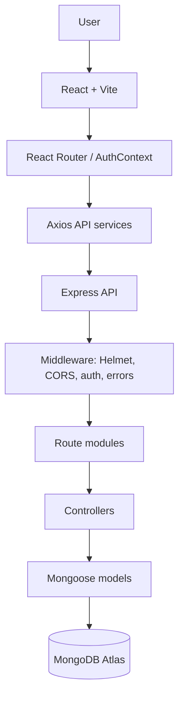
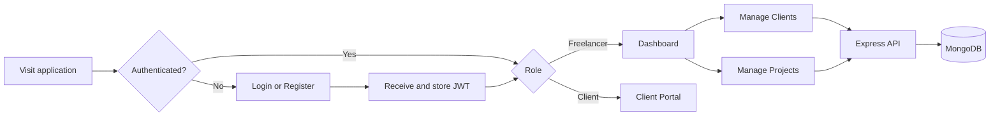
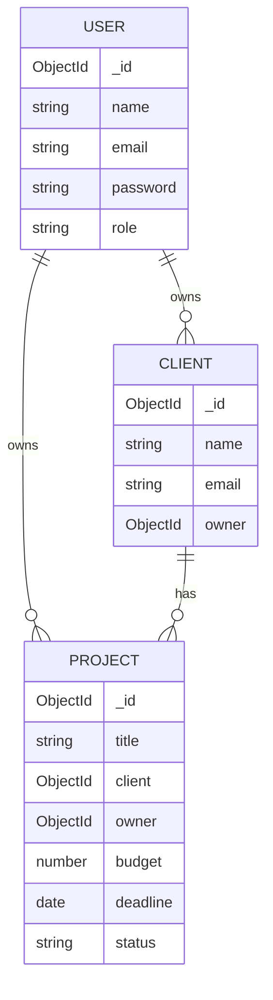

# FreelanceHub PK

Full-stack freelance work-management platform for managing clients, projects, deadlines, budgets, and role-based access.

[Live Demo](https://capstone-project-freelance-hub-sk8u.vercel.app/) | [Backend API](https://capstone-project-freelance-hub.vercel.app/) | [GitHub Repository](https://github.com/sabeerdeveloper555/Capstone-Project-FreelanceHub)

## Overview

FreelanceHub-PK is a full-stack freelance work-management application. It gives freelancers authenticated views for managing clients, tracking projects, monitoring deadlines, and reviewing budget and status metrics. It also supports client accounts and an authenticated client portal view.

## Problem

Freelancers need a single place to keep client details, project delivery information, deadlines, budgets, and account access organized instead of managing those details across disconnected tools.

## Solution

The application combines a React frontend with an Express API and MongoDB/Mongoose persistence. JWT authentication, route protection, role checks, ownership checks, CRUD screens, dashboard metrics, validation, and user feedback states are implemented across the stack.

## Key Features

### Authentication and Authorization

- Public registration and login for `freelancer` and `client` roles.
- JWT creation on successful registration or login.
- JWT persistence in browser local storage and attachment to API requests through Axios.
- Protected frontend routes and public-route redirects for authenticated users.
- Frontend role routing for freelancer and client views, including a `/403` unauthorized page.
- Backend `protect` middleware for JWT verification and `authorizeRoles` middleware for role checks.
- Password hashing through a Mongoose `pre('save')` hook using `bcryptjs`.

### Client Management

- Freelancer-only client create, list, view, update, and delete operations.
- Client records include name, email, company, phone, country, notes, and owner.
- Ownership is assigned from the authenticated user and checked for single-record operations.
- Client search covers name, email, company, and phone.

### Project Management

- Freelancer-only project create, list, view, update, and delete operations.
- Projects link to a client and validate that the client belongs to the authenticated freelancer.
- Supported statuses are `Planning`, `In Progress`, `Review`, `Completed`, and `On Hold`.
- Project search, status filtering, and sorting by recent order, deadline, or budget.

### Dashboard and Analytics

- Freelancer dashboard with total clients, projects, budgets, completion and in-progress budgets, and average budget.
- Project status distribution, deadline summaries, recent projects, monthly project counts, and financial statistics.

### Search, Filtering, and Sorting

- Client search across name, email, company, and phone.
- Project search, status filtering, and sorting by recent order, deadline, or budget.

### Client Portal

- Authenticated client role with a protected `/client` portal view.
- The current portal shows client identity and workspace state; client-scoped project APIs are not implemented.

### Validation and Error Handling

- Client-side validation for authentication and CRUD forms, with matching server-side validation in controllers and Mongoose schemas.
- Loading skeletons, retryable API error states, and empty states on core application pages.

### Responsive UI

- Responsive Tailwind CSS layouts with desktop sidebar navigation, mobile navigation controls, adaptive forms, and horizontally scrollable wide tables.

File uploads are not implemented in the current repository.

### Dashboard

- Freelancer dashboard overview with total clients, total projects, budgets, completed and in-progress budgets, and average budget.
- Project status distribution.
- Deadline summary for overdue, due soon, and completed projects.
- Recent projects list.
- Backend endpoints for monthly project counts, status counts, and financial statistics.

### UI and UX

- Responsive Tailwind CSS layouts with desktop sidebar navigation and mobile navigation controls.
- Horizontally scrollable wide tables and responsive form/grid layouts.
- Loading skeletons, empty states, API error messages, and retry actions on core pages.
- Dark-mode utility classes are present throughout the interface. No explicit theme toggle or persisted theme preference is implemented in the repository.
- Form labels, semantic headings, button names, and action labels support accessible interaction patterns.

## MVP Requirements Coverage

| Requirement                      | Implementation evidence                                                                                                                   |
| -------------------------------- | ----------------------------------------------------------------------------------------------------------------------------------------- |
| 4-5+ frontend pages/views        | Login, Register, Dashboard, Clients, Projects, Client Portal, and Unauthorized views are routed in `frontend/src/App.jsx`.                |
| CRUD for 2 related resources     | Clients and Projects each support create, list/read, update, and delete operations. Projects reference Clients.                           |
| Real database persistence        | MongoDB is accessed through Mongoose models and `MONGODB_URI`.                                                                            |
| Authentication                   | Registration and login issue JWTs; passwords are hashed with `bcryptjs`.                                                                  |
| Protected routes                 | React `ProtectedRoute` and backend `protect` middleware protect authenticated resources.                                                  |
| Role-based permissions           | Freelancer-only backend resources and client/freelancer frontend role routes are implemented.                                             |
| Client and server validation     | Browser form validation, controller validation, and Mongoose schema validation are present.                                               |
| Loading, error, and empty states | Core dashboard, client, and project views render loading, API error, retry, and empty states.                                             |
| Responsive UI                    | Tailwind responsive layouts, mobile navigation, adaptive forms, and overflow handling are implemented.                                    |
| Live deployment                  | Frontend and backend are deployed on Vercel at the URLs in the Deployment section.                                                        |
| Public GitHub repository         | [Capstone-Project-FreelanceHub](https://github.com/sabeerdeveloper555/Capstone-Project-FreelanceHub) is the referenced public repository. |
| README architecture/setup        | This README documents architecture, routes, environment variables, local setup, testing, and deployment.                                  |
| 10+ tests                        | 5 frontend tests plus 7 backend tests, for 12 named tests total.                                                                          |

## Stretch Goals

- Search, filters, and sorting across client and project management views.
- Dashboard analytics with project status, deadline, monthly, and financial metrics.
- Role-specific client portal view with protected navigation.

File uploads, dark-mode toggling, payments, WebSockets, Docker, and CI/CD are not implemented features.

## Tech Stack

| Layer                   | Technologies                                                                          |
| ----------------------- | ------------------------------------------------------------------------------------- |
| Frontend                | React 18, Vite, React Router, Axios, Tailwind CSS, Lucide React                       |
| Backend                 | Node.js ES modules, Express                                                           |
| Database                | MongoDB through Mongoose                                                              |
| Authentication          | JSON Web Tokens with `jsonwebtoken`; password hashing with `bcryptjs`                 |
| Security and middleware | Helmet, CORS, Morgan, Express JSON/urlencoded parsers                                 |
| Testing                 | Vitest, React Testing Library, Testing Library jest-dom, user-event, jsdom, Supertest |
| Deployment              | Vercel for frontend and backend; live URLs are documented in the Deployment section   |

## Architecture



The repository has controller modules and route modules; it does not contain a separate service layer on the backend.

## Application Flow



## Authentication and Authorization

Registration accepts a name, email, password, and optional role. The backend validates the input, normalizes the email, hashes the password through the User model hook, creates the user, and returns a signed JWT. Login validates credentials and returns a JWT and safe user fields.

The frontend stores the token under `freelancehub_token`. The Axios request interceptor sends it as a Bearer token. Logout removes the stored token and clears the authenticated user; a `401` response also removes the token and dispatches an `auth:logout` event. On initialization, the frontend calls `/api/auth/me` when a stored token exists and clears invalid authentication state when that request fails.

Backend protected routes verify the JWT, load the user without the password, and apply role checks. Client and project records additionally check ownership. Frontend role routes redirect unauthorized users to `/403`.

## Database

### User

- `name`: required string, minimum length 2.
- `email`: required, unique, lowercased and trimmed, schema-validated.
- `password`: required, minimum length 6, hashed before save.
- `role`: required enum: `freelancer` or `client`.
- Automatic `createdAt` and `updatedAt` timestamps.

### Client

- `name` and `email`: required; email is lowercased, trimmed, and schema-validated.
- `company`, `phone`, `country`, `notes`: optional trimmed strings defaulting to empty strings.
- `owner`: required indexed reference to `User`.
- Automatic timestamps.

### Project

- `title`: required trimmed string.
- `description`: optional trimmed string.
- `client`: required indexed reference to `Client`.
- `budget`: required number with a minimum of zero.
- `deadline`: required date.
- `status`: required enum: `Planning`, `In Progress`, `Review`, `Completed`, or `On Hold`.
- `owner`: required indexed reference to `User`.
- Automatic timestamps.



There is no verified cascade-delete behavior from clients to projects.

The relationships are `User -> Clients`, `User -> Projects`, and `Client -> Projects`. Client and project ownership is enforced against the authenticated user; deleting a client does not document or implement cascade deletion of related projects.

## API Documentation

All endpoints below are mounted by `backend/src/app.js`.

Production API base URL: `https://capstone-project-freelance-hub.vercel.app/api`

| Method | Endpoint                          | Purpose                                                          | Auth / role                         |
| ------ | --------------------------------- | ---------------------------------------------------------------- | ----------------------------------- |
| GET    | `/`                               | Return API metadata and health-check link                        | Public                              |
| GET    | `/api/health`                     | Return API, process, environment, and database connection status | Public                              |
| GET    | `/health`                         | Health-check alias                                               | Public                              |
| POST   | `/api/auth/register`              | Register a user and return a JWT                                 | Public                              |
| POST   | `/api/auth/login`                 | Authenticate credentials and return a JWT                        | Public                              |
| GET    | `/api/auth/me`                    | Return the authenticated user profile                            | JWT                                 |
| POST   | `/api/clients`                    | Create a client                                                  | JWT + freelancer                    |
| GET    | `/api/clients`                    | List owned clients                                               | JWT + freelancer                    |
| GET    | `/api/clients/:id`                | Get one owned client                                             | JWT + freelancer; ownership checked |
| PUT    | `/api/clients/:id`                | Update one owned client                                          | JWT + freelancer; ownership checked |
| DELETE | `/api/clients/:id`                | Delete one owned client                                          | JWT + freelancer; ownership checked |
| POST   | `/api/projects`                   | Create a project for an owned client                             | JWT + freelancer                    |
| GET    | `/api/projects`                   | List owned projects with populated client fields                 | JWT + freelancer                    |
| GET    | `/api/projects/:id`               | Get one owned project                                            | JWT + freelancer; ownership checked |
| PUT    | `/api/projects/:id`               | Update one owned project                                         | JWT + freelancer; ownership checked |
| DELETE | `/api/projects/:id`               | Delete one owned project                                         | JWT + freelancer; ownership checked |
| GET    | `/api/dashboard`                  | Return dashboard metrics and recent projects                     | JWT + freelancer                    |
| GET    | `/api/dashboard/projects/monthly` | Return monthly project counts                                    | JWT + freelancer                    |
| GET    | `/api/dashboard/projects/status`  | Return counts for each project status                            | JWT + freelancer                    |
| GET    | `/api/dashboard/financials`       | Return budget totals grouped by financial status                 | JWT + freelancer                    |

## Frontend Pages and Views

The application defines 9 route entries in `frontend/src/App.jsx`.

| Route        | Page / view        | Purpose                                                                        | Access                   |
| ------------ | ------------------ | ------------------------------------------------------------------------------ | ------------------------ |
| `/`          | Root redirect      | Sends users to login, dashboard, or client portal based on auth state and role | Public entry             |
| `/login`     | Login              | Authenticate an account                                                        | Public                   |
| `/register`  | Register           | Create a freelancer or client account                                          | Public                   |
| `/dashboard` | Dashboard          | View freelancer metrics and recent projects                                    | Authenticated freelancer |
| `/clients`   | Clients            | Manage client records                                                          | Authenticated freelancer |
| `/projects`  | Projects           | Manage project records and filters                                             | Authenticated freelancer |
| `/client`    | Client Portal      | Show authenticated client workspace state                                      | Authenticated client     |
| `/403`       | Unauthorized       | Show forbidden-access view                                                     | Public                   |
| `*`          | Catch-all redirect | Redirect unknown routes to `/`                                                 | Public                   |

The client portal currently renders authenticated client identity and an empty project-information state. No client-scoped project API route is mounted.

## CRUD Operations

### Clients

The backend and freelancer UI support create, read/list, update, and delete operations. Individual reads and mutations verify ownership.

### Projects

The backend and freelancer UI support create, read/list, update, and delete operations. Project creation and client reassignment validate client ownership, and individual reads and mutations verify project ownership.

## Validation and Error Handling

- Login validates required email/password fields and email format in the browser.
- Registration validates name, email, password length, and role.
- Client forms require name and email; the backend also validates email format.
- Project forms require title, client, budget, and deadline; the backend validates ObjectId format, client ownership, budget, deadline, and status.
- Backend controllers return structured `success` and `message` fields for validation and authorization failures.
- Express provides a not-found handler and centralized error handler.
- Dashboard, Clients, and Projects render loading skeletons, empty states, visible API errors, and retry actions.

## Responsive Design

Tailwind responsive classes provide breakpoint-based grids, spacing, and navigation. The desktop layout uses a sidebar; mobile navigation uses the mobile header and menu components. Wide data tables and dashboard project lists use horizontal overflow containers. Forms and action controls adapt between stacked and multi-column layouts.

## Dark Mode

The frontend includes `dark:` Tailwind classes across the layout, forms, cards, tables, badges, and state components. The repository does not contain a theme toggle, theme context, or persisted theme preference, so the available behavior is styling support through Tailwind dark-mode classes rather than a documented in-app theme switcher.

## Case Study

[Read the full case study](./CASE_STUDY.md)

The case study covers the problem, technology choices, ownership-enforcement challenge, solution, and result. Its deployment subsection still contains pre-deployment wording and should be refreshed separately before final portfolio submission.

## Testing

The repository contains exactly 12 named tests: 5 frontend and 7 backend.

| Area     | Test                                                             | Purpose                                                                     |
| -------- | ---------------------------------------------------------------- | --------------------------------------------------------------------------- |
| Frontend | `renders the login form controls`                                | Verifies the login heading, email input, password input, and submit button. |
| Frontend | `shows login validation errors for empty credentials`            | Verifies existing empty-login validation messages.                          |
| Frontend | `renders registration fields and validates a short password`     | Verifies registration controls and short-password validation.               |
| Frontend | `redirects an unauthenticated user to login`                     | Verifies protected-route redirect behavior.                                 |
| Frontend | `shows the empty state when the API returns no clients`          | Verifies the Clients empty state and action.                                |
| Backend  | `registers a freelancer and returns a JWT`                       | Verifies registration status, user response fields, and token creation.     |
| Backend  | `logs in with registered credentials`                            | Verifies successful credential authentication and JWT response.             |
| Backend  | `rejects invalid login credentials`                              | Verifies invalid credentials return `401`.                                  |
| Backend  | `rejects protected client access without a token`                | Verifies missing-token rejection.                                           |
| Backend  | `creates and retrieves clients for the authenticated freelancer` | Verifies authenticated client create and list response behavior.            |
| Backend  | `creates and retrieves a project linked to an owned client`      | Verifies project creation, client linking, and list response behavior.      |
| Backend  | `forbids a client role from accessing freelancer resources`      | Verifies backend freelancer-only RBAC.                                      |

Frontend tests use Vitest, React Testing Library, jest-dom, user-event, and jsdom. Backend tests use Vitest and Supertest. Backend model methods are intentionally test-doubled; the backend suite does not connect to a real MongoDB instance or an in-memory MongoDB server. Therefore, the tests exercise HTTP routing, middleware, validation, controller behavior, JWT handling, and response contracts without claiming real persistence integration.

Run the suites with:

```powershell
cd frontend
npm test

cd ..\backend
npm test
```

## Security

Verified security-related implementation includes:

- Password hashing with `bcryptjs` before User persistence.
- JWT signing and verification with configurable `JWT_SECRET` and `JWT_EXPIRES_IN`.
- Protected backend routes and frontend protected routes.
- Freelancer/client role checks and ownership checks for client and project resources.
- Helmet security headers.
- CORS configuration with the local and deployed frontend origins listed in `backend/src/app.js`.
- Input and schema validation for authentication, clients, and projects.
- Environment variables for connection strings and authentication configuration.

## Project Structure

```text
FreelanceHub-PK/
├── README.md
├── CASE_STUDY.md
├── backend/
│   ├── package.json
│   ├── server.js
│   ├── config/db.js
│   └── src/
│       ├── app.js
│       ├── config/db.js
│       ├── controllers/
│       ├── middleware/
│       ├── models/
│       ├── routes/
│       ├── test/api.test.js
│       └── utils/
└── frontend/
    ├── package.json
    ├── vite.config.js
    ├── tailwind.config.js
    └── src/
        ├── App.jsx
        ├── main.jsx
        ├── index.css
        ├── components/
        │   ├── auth/
        │   ├── common/
        │   ├── layout/
        │   └── ui/
        ├── context/
        ├── hooks/
        ├── pages/
        ├── services/
        ├── test/
        └── utils/
```

## Installation and Local Development

### Prerequisites

- Node.js and npm.
- A MongoDB instance or MongoDB Atlas connection string.

### 1. Clone the repository

Clone the public repository:

```powershell
git clone https://github.com/sabeerdeveloper555/Capstone-Project-FreelanceHub.git
cd FreelanceHub-PK
```

### 2. Install backend dependencies

```powershell
cd backend
npm install
```

### 3. Configure backend environment variables

Copy `backend/.env.example` to `backend/.env` and set a real MongoDB connection string and JWT secret. Do not commit the `.env` file.

### 4. Start the backend

Development mode:

```powershell
npm run dev
```

The configured default port is `5000` when `PORT` is not overridden. The production-style script is `npm start`.

### 5. Install and configure the frontend

```powershell
cd ..\frontend
npm install
```

Copy `frontend/.env.example` to `frontend/.env` if the API base URL needs to be changed. The default frontend API client base URL is `/api` when `VITE_API_BASE_URL` is not set.

### 6. Start the frontend

```powershell
npm run dev
```

Vite is configured for port `5173` and proxies `/api` requests to `http://localhost:5000` during development.

Available frontend scripts are `dev`, `build`, `lint`, `preview`, and `test`. Available backend scripts are `start`, `dev`, and `test`.

To create a production frontend build:

```powershell
cd frontend
npm run build
```

## Environment Variables

| Variable            | Location | Purpose                                                    | Required                                                                                     |
| ------------------- | -------- | ---------------------------------------------------------- | -------------------------------------------------------------------------------------------- |
| `PORT`              | Backend  | HTTP server port; defaults to `5000`                       | No                                                                                           |
| `NODE_ENV`          | Backend  | Runtime environment label and development logging behavior | No                                                                                           |
| `MONGODB_URI`       | Backend  | MongoDB/MongoDB Atlas connection string                    | Yes for backend startup                                                                      |
| `CLIENT_URL`        | Backend  | Documented frontend origin for local development           | Template value: `http://localhost:5173`; current CORS code uses a static allowlist           |
| `JWT_SECRET`        | Backend  | JWT signing and verification secret                        | No; code has a development fallback, but a private configured value is required for real use |
| `JWT_EXPIRES_IN`    | Backend  | JWT expiration setting                                     | No; code defaults to `7d`                                                                    |
| `VITE_API_BASE_URL` | Frontend | Axios API base URL                                         | No; defaults to `/api`                                                                       |

For production, configure the backend deployment with `CLIENT_URL=https://capstone-project-freelance-hub-sk8u.vercel.app` as deployment metadata, and configure the frontend with `VITE_API_BASE_URL=https://capstone-project-freelance-hub.vercel.app/api`. The current backend CORS implementation explicitly allowlists the deployed frontend origin in code rather than reading `CLIENT_URL`.

## Deployment

### Frontend

Vercel: https://capstone-project-freelance-hub-sk8u.vercel.app/

### Backend API

Vercel: https://capstone-project-freelance-hub.vercel.app/

### API Health Check

https://capstone-project-freelance-hub.vercel.app/api/health

The frontend is deployed on Vercel and communicates with the production API through `VITE_API_BASE_URL`. The backend serverless entrypoint connects to MongoDB Atlas through `MONGODB_URI`. Production CORS currently permits the deployed frontend origin through the allowlist in `backend/src/app.js`.

## Screenshots

No screenshot assets are currently stored in the repository. Add screenshots before final portfolio submission.

## Development Phases

The repository history records implementation and deployment work, including Vercel backend configuration, frontend SPA routing, and production CORS updates. This README documents the current repository state rather than reconstructing unverified development phases.

## Challenges and Solutions

A verified implementation complexity is keeping ownership consistent across related resources. Client and project controllers derive ownership from the authenticated user, check client ownership before project creation or reassignment, and check record ownership for individual reads and mutations. This keeps the relationship between a freelancer, their clients, and their projects enforced at the API boundary.

The repository history also records a deployment configuration challenge through separate fixes for Vercel backend deployment, frontend SPA routing, and production CORS. The current README reflects the resulting live URLs and CORS allowlist behavior.

## Future Enhancements

The following are future ideas, not implemented features:

- Add client-scoped project data and client-facing project actions.
- Add messaging and notifications between freelancers and clients.
- Add file or document management for project deliverables.
- Add payment or invoicing integration.
- Add automated CI checks and a documented deployment pipeline.
- Add browser-level end-to-end tests and real persistence test infrastructure.

## Roadmap

1. Refresh the case-study deployment subsection with the current Vercel and CORS details.
2. Expand the client portal with server-backed client-scoped project information.
3. Add CI execution for lint, build, and both test suites.
4. Add screenshots and portfolio-ready usage flows.

## License

License: To be added.
